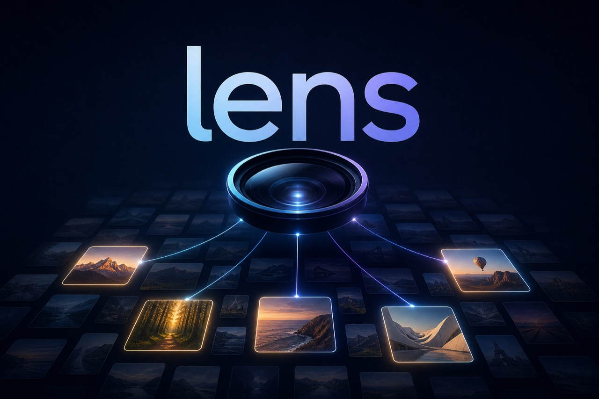

<p align="center">
  
</p>

<h1 align="center">lens</h1>

<p align="center"><b>Ask for a photo the way you'd ask a person. Get it in seconds.</b></p>

<p align="center">
  <a href="https://github.com/treygoff24/lens/actions/workflows/ci.yml"></a>
  <a href="https://crates.io/crates/lens-cli"></a>
  <a href="LICENSE"></a>
</p>

You have a folder with a few thousand photos and you need "the hero shot of the beach club." Your options today are scrolling thumbnails or standing up a vector database. `lens` is the third option: caption every image once with a fast vision model (Cerebras `gemma-4-31b`), store the captions in one plain JSONL file, then answer any query by putting the **entire index into a single model call**. No embedding service, no daemon, no server. The index is a file; search is a request.

That sounds like it shouldn't scale, so here are measured numbers from a real 1,100-image library: indexed in 93 seconds for $2.29 with zero failures, and queries answered in 2–6 seconds for about $0.20 each.

`lens` is agent-first: stdout carries exactly one JSON success envelope, stderr exactly one JSON error envelope, exit codes are a stable dictionary, and every error includes a paste-ready `suggestedFix`. There are no prompts, colors, spinners, or implicit modes. Humans are welcome too — `find --gallery` writes an HTML contact sheet for eyeballs.

## Install

```sh
# Homebrew (macOS/Linux)
brew install treygoff24/tap/lens

# Shell installer — prebuilt binary, no toolchain needed
curl --proto '=https' --tlsv1.2 -LsSf https://github.com/treygoff24/lens/releases/latest/download/lens-cli-installer.sh | sh

# Cargo — builds from source, needs Rust 1.85+
cargo install lens-cli
```

All three install a binary named `lens`. (The crates.io package is `lens-cli` because the bare `lens` name was taken.)

## 🤖 If you're an agent reading this

You can set this up for your human right now. **[AGENTS.md](AGENTS.md)** is the complete machine-facing contract: install paths, key setup, the envelope schemas, the exit-code dictionary, cost-safety rails (`--dry-run`, `--max-dollars`), and the failure modes that would otherwise cost you a debugging loop. The binary also describes itself: `lens capabilities --json` and `lens schema all --json`.

## Quickstart

```sh
export CEREBRAS_API_KEY=...   # get one at https://cloud.cerebras.ai

lens --json index ./photos                      # caption + index (spends money, resumable)
lens --json find "beach club hero shot" --dir ./photos --top 3
lens --json status --dir ./photos               # free, offline: what's indexed/stale, cost to bring current
```

Always know the cost before you spend: every paid command supports `--dry-run` (zero network, closed-form projection) and `--max-dollars` / `--max-seconds` hard caps.

## Commands

```sh
lens index [DIR]
lens find <QUERY> [--dir DIR] [--top N] [--kind KIND] [--gallery PATH]
lens status [--dir DIR]
lens doctor [--online]
lens capabilities
lens schema [response|error|all]
```

Global flags: `--json`, `--model`, `--max-dollars`, `--max-seconds`, `--index-path`, `--dry-run`, and `--concurrency N` (capped at 50; used by indexing and chunked find).

`find --kind photo` filters the index to records of the given kinds (repeatable or comma-separated: `--kind photo,screenshot`) before anything is sent to the model — improving precision when you want photographs rather than renders or screenshots, and cutting input tokens. Kinds come from the caption model's open vocabulary (`photo`, `graphic`, `screenshot`, `document`, …); the applied filter is echoed back as `kindFilter` in the envelope.

## How it works

**Indexing** walks the directory deterministically, skips unchanged files via a `(relPath, size, mtime)` freshness key, normalizes each image (≤1600px JPEG in memory — nothing is written except the index), and fans captions out across 25 concurrent workers. Every model call passes a budget reservation gate first, so parallel workers cannot overshoot `--max-dollars`. Results append to the index as they land: a killed run resumes exactly where it stopped.

**Search** loads the index, dedupes and sorts it into a deterministic snapshot, and serializes one line per image. Small enough (≤100K estimated tokens), it goes to the model in one shot with the index as a byte-stable prompt prefix; the model returns matching line ids. Bigger libraries split into chunks searched in parallel, and one rerank call over the union picks the final ranking — two model rounds, still seconds.

Example find envelope:

```json
{
  "schema": "lens.cli.response.v1",
  "ok": true,
  "command": "find",
  "requestId": "00000000-0000-0000-0000-000000000000",
  "data": {
    "query": "beach club hero shot",
    "hits": [
      {
        "path": "/tmp/photos/1.png",
        "relPath": "1.png",
        "filename": "mock-image",
        "description": "mock image caption",
        "tags": ["mock", "fixture"],
        "kind": "photo",
        "rank": 1
      }
    ],
    "searched": 2,
    "mode": "single_shot",
    "chunks": 1,
    "warnings": [],
    "outcome": "answered"
  },
  "costDollars": { "model": 0.00485, "search": 0.0, "total": 0.00485, "estimated": false },
  "budget": { "hit": null },
  "diagnostics": { "durationMs": 25, "retries": 0 }
}
```

`--dry-run` returns the same envelope family with `data.dryRun: true` and `costDollars.estimated: true`. It makes no provider requests and does not require `CEREBRAS_API_KEY`.

## Cost and performance expectations

All numbers measured, not projected, unless marked:

| What | Measured |
| --- | --- |
| Index 1,100 images (real-estate/aerial corpus) | 93s, $2.29, 0 failures |
| Find, 1,100-image index (2 chunks) | 2–6s, ~$0.20 per query |
| Caption cost, average | $0.00166/image (budget gate reserves a worst-case $0.008) |

Sizing: whether a library fits the cheap single-shot path depends on caption richness, not just image count. Terse captions serialize at ~65 estimated tokens per image (≈1,500 images per 100K-token call); rich captions (detailed scenes + OCR text) run ~140 (≈700 images). Beyond that, `find` chunks automatically — cost grows linearly with index size, since every query pushes the whole index through the model. `find --dry-run` tells you which path a query will take and its projected cost.

Prompt caching on Cerebras is a **latency** feature, not a price discount: cached input tokens bill at the full input rate ([their docs are explicit](https://inference-docs.cerebras.ai/capabilities/prompt-caching)). Repeat queries against an unchanged index are noticeably faster (measured 5.9s → 1.8s), never cheaper. Pricing basis: gemma-4-31b at $2.15/M input, $2.70/M output tokens.

Rate limits (Cerebras developer tier): 300 requests/minute, 500K tokens/minute. The indexer's default concurrency of 25 intentionally rides above the sustained rate and absorbs 429s with retry/backoff — the 1,100-image run retried 50 times (4.5%) and still finished in 93s. Free-trial keys have much lower limits (and a 65K context window vs 131K paid), so expect indexing to be slower there.

## Exit codes

| Code | Meaning | Channel and shape |
| ---: | --- | --- |
| 0 | ok | success envelope on stdout |
| 1 | usage | error envelope on stderr, stdout empty |
| 2 | auth | error envelope on stderr, stdout empty, except `doctor --online` reports structured checks on stdout |
| 3 | config | error envelope on stderr, stdout empty |
| 4 | network | error envelope on stderr, stdout empty |
| 5 | upstream | error envelope on stderr, stdout empty |
| 6 | rate limit | error envelope on stderr, stdout empty |
| 10 | partial or refused | success envelope on stdout with `ok: true` and `budget.hit` set |
| 11 | no input | error envelope on stderr, stdout empty |

Exit 10 is deliberate. `index` is resumable, so a budget-hit partial index is durable progress. `find` has no useful partial result, so a budget refusal returns `data.outcome: "refused"`, empty `hits`, `budget.hit`, and exit 10.

Per-file caption failures and skips (`unsupported_format`, `corrupt_image`, `too_large`, `budget_refused`) are reported inside the success envelope; they do not fail an `index` run.

## Environment

| Variable | Required for | Default |
| --- | --- | --- |
| `CEREBRAS_API_KEY` | `index`, `find` (live calls only — `--dry-run` and zero-match filters need no key), `doctor --online` | none |
| `LENS_API_BASE` | Cerebras-compatible API base | `https://api.cerebras.ai/v1` |
| `LENS_MODEL` | model default | `gemma-4-31b` |
| `LENS_MAX_CONCURRENCY` | chunk/search worker default | `25` |
| `XDG_DATA_HOME` | index storage root | `~/.local/share` |

## Index storage and locking

Libraries can be read-only; the index lives outside the library, keyed by the canonicalized path:

```text
${XDG_DATA_HOME:-~/.local/share}/lens/libraries/<sha256(canonical_path)[..16]>/
  meta.json      # model, promptVersion, normalizerVersion, schemaVersion — any mismatch marks the index stale
  index.jsonl    # one record per image
  index.lock     # advisory single-writer lock
```

`--index-path PATH` overrides the store directory. `lens index` takes a per-library advisory lock (`create_new`); a fresh conflict exits 3 naming the lock path, and a lock older than 30 minutes is treated as stale and stolen with a warning. Index loading tolerates one torn trailing line, so a hard kill mid-append cannot corrupt reads.

## Platform support

- **macOS** — full support. HEIC and decode failures fall back to `sips` conversion.
- **Linux** — works; pure-Rust decoding covers jpg/png/webp/gif/bmp/tiff. There is no `sips`, so HEIC files and decode-fallback cases are recorded as `unsupported_format` / `corrupt_image` skips instead of being converted. Runs never fail because of them.
- **Windows** — untested, unsupported (v1 non-goal).

## Doctor and self-description

```sh
lens doctor --json            # offline: config, key presence, sips availability, storage writability
lens doctor --online --json   # adds a one-token Cerebras probe; bad key exits 2 but still reports
lens capabilities --json      # commands, flags, spend/read-only annotations, exit codes, env vars
lens schema all --json        # JSON Schema for success and error envelopes
```

Doctor never prints secret values.

## Development

```sh
cargo fmt --check && cargo clippy --all-targets --all-features -- -D warnings && cargo test && cargo build --release
```

Integration tests run the real binary against a local mock Cerebras server — no API key or network needed, which is also how CI runs. For diagnosing caption failures against the live API there's a diagnosis harness:

```sh
CEREBRAS_API_KEY=... cargo run --release --example debug_caption -- path/to/image.jpg
```

The design doc — including the adversarial design review and its accepted/rejected findings — is at [`docs/plans/2026-07-01-lens-cli-design.md`](docs/plans/2026-07-01-lens-cli-design.md).

## Provenance

lens was designed, built, reviewed, and shipped almost entirely by [Claude](https://claude.com/claude-code) (Anthropic's Fable 5 and friends, with Codex and Cursor lanes as adversarial reviewers), coordinated through a multi-model build loop. The human in the loop is [Trey Goff](https://github.com/treygoff24), who mostly said "yes," "ship it," and paid for the tokens. Every cost and performance number in this README was measured on real runs, not asserted.

Sibling project: same envelope contract and exit-code dictionary as `recon` (agent-first web recon CLI).

## License

Apache-2.0
